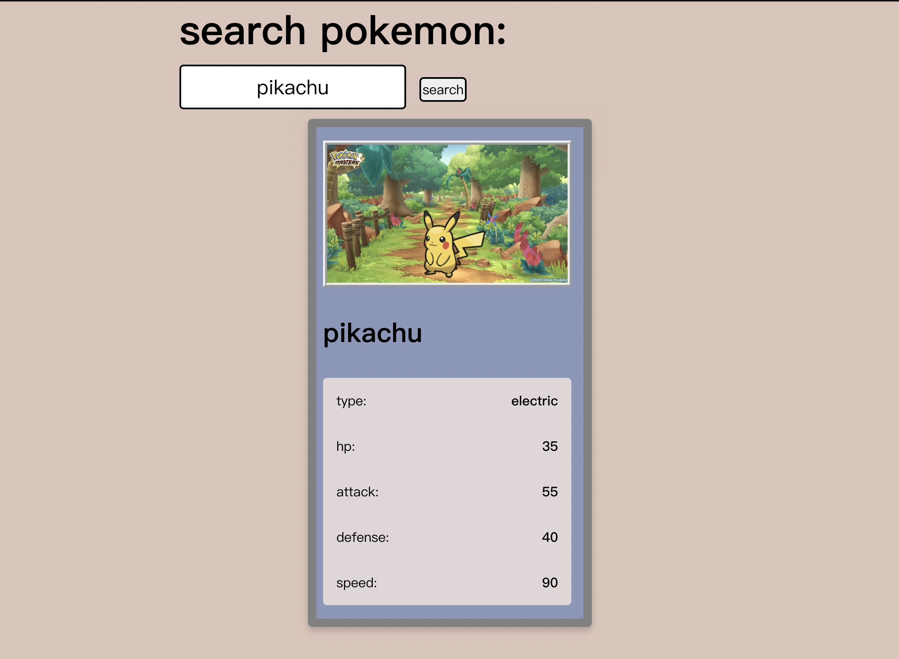

# Pokemon Searcher React App
===============================

This is a simple React app that allows users to search for information on different Pokemon by typing in the Pokemon's name. The app uses the [Poke API](https://pokeapi.co/) to retrieve the Pokemon information.

## Installation
------------------

To install the app, follow these steps:

1. Clone this repository.
2. Navigate to the project directory.
3. Install the required dependencies using `npm install`.
4. Start the app using `npm start`.
5. The app will open in your default browser at `http://localhost:3000/`.

